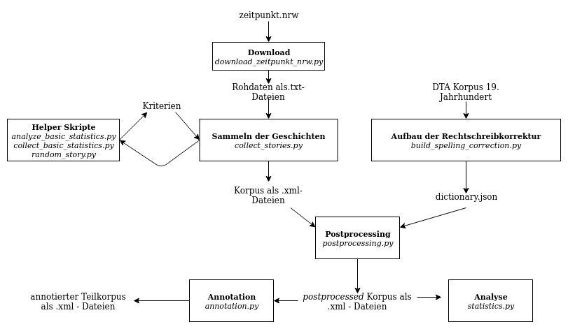

# Neues aus Köln

## Project Structure 

## Folder Structure

*corpus*: final corpus

*data*: raw texts

*helper*: scripts to help finding the best rules for filtering the stories out. Mostly not well documented.

*output*: output files (statistics, ...)

*resources*: files that will be needed for the scripts